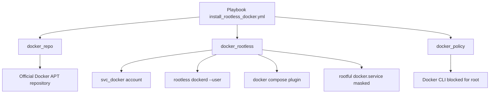
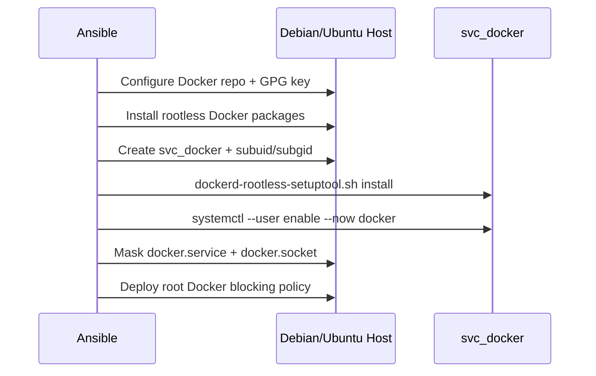

# `tomonix.rootless_docker`

An Ansible collection to deploy Docker Engine and Docker Compose in rootless mode on Debian/Ubuntu with a dedicated service account (`svc_docker`) and a root-side blocking policy.

## Objectives

- Install rootless Docker with a non-privileged service account.
- Disable rootful mode (`docker.service` and `docker.socket`).
- Standardize the runtime environment (`DOCKER_HOST`) for operations.
- Provide a readable, modular, and idempotent collection.

## Architecture



## Execution Sequence



## Roles

- `tomonix.rootless_docker.docker_repo`
- `tomonix.rootless_docker.docker_rootless`
- `tomonix.rootless_docker.docker_policy`

## Main Variables

| Variable | Default value | Description |
|---|---|---|
| `docker_rootless_service_user` | `svc_docker` | Service account for the rootless daemon |
| `docker_rootless_state` | `started` | Docker user service state (`started` or `stopped`) |
| `docker_rootless_install_compose_plugin` | `true` | Installs the `docker compose` plugin |
| `docker_rootless_disable_system_service` | `true` | Masks rootful `docker.service` and `docker.socket` |
| `docker_policy_enforce_root_cli_block` | `true` | Blocks direct root usage of `docker` via shell profile |

## Prerequisites

- `ansible-core >= 2.14`
- Debian or Ubuntu target host
- SSH access and privilege escalation (`become`)
- Internet access on target hosts (official Docker repository)

## Example Inventory

```yaml
all:
  children:
    docker_rootless_hosts:
      children:
        docker_rootless_remote_hosts:
          vars:
            ansible_user: root
          hosts:
            ubuntu25:
              ansible_host: 192.168.1.76
        docker_rootless_local_hosts:
          vars:
            ansible_connection: local
            ansible_user: root
          hosts:
            localhost:
              ansible_host: 127.0.0.1
```

## Run

Standard run:

```bash
ANSIBLE_LOCAL_TEMP=/tmp ANSIBLE_REMOTE_TEMP=/tmp \
ansible-playbook collections/ansible_collections/tomonix/rootless_docker/playbooks/install_rootless_docker.yml
```

Target remote hosts only:

```bash
ANSIBLE_LOCAL_TEMP=/tmp ANSIBLE_REMOTE_TEMP=/tmp \
ansible-playbook collections/ansible_collections/tomonix/rootless_docker/playbooks/install_rootless_docker.yml \
  -l docker_rootless_remote_hosts
```

Verification mode (dry-run):

```bash
ANSIBLE_LOCAL_TEMP=/tmp ANSIBLE_REMOTE_TEMP=/tmp \
ansible-playbook --check --diff \
  collections/ansible_collections/tomonix/rootless_docker/playbooks/install_rootless_docker.yml
```

## Post-Install Verification

On the target host:

```bash
su - svc_docker -c 'docker info'
su - svc_docker -c 'docker compose version'
systemctl status docker.service docker.socket
```

Expected result:

- `docker info` responds for `svc_docker`.
- `docker compose version` responds.
- `docker.service` and `docker.socket` are `masked/inactive`.

## Screenshots

Add your screenshots in `docs/images/`:

- `docs/images/playbook-success.png`
- `docs/images/docker-info-svc-user.png`
- `docs/images/systemd-masked-services.png`

Example Markdown integration:

```markdown


```

## Security Notes

- Root blocking is an operations policy (shell profile + masked rootful services).
- `root` remains technically a superuser by Unix design.
- For a stricter posture, combine this with sudoers and auditd controls.
