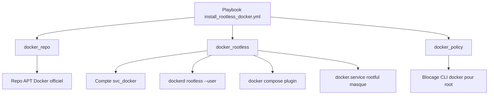
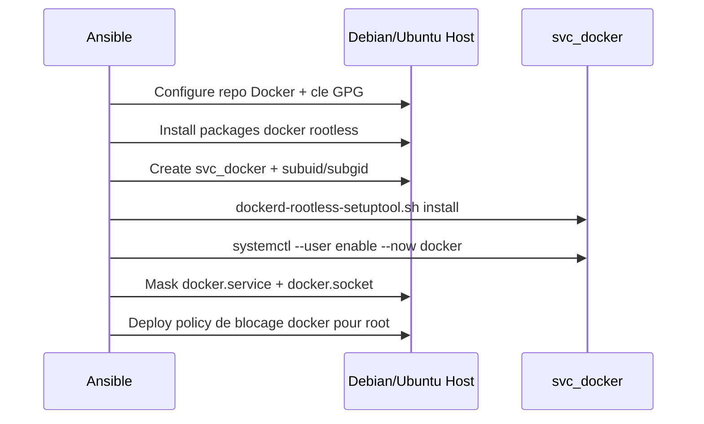

# `tomonix.rootless_docker`

Collection Ansible pour déployer Docker Engine et Docker Compose en mode rootless sur Debian/Ubuntu avec un compte de service dédié (`svc_docker`) et une politique de blocage côté `root`.

## Objectifs

- Installer Docker rootless avec un compte de service non privilégié.
- Désactiver le mode rootful (`docker.service` et `docker.socket`).
- Standardiser l’environnement (`DOCKER_HOST`) pour l’exploitation.
- Fournir une collection lisible, modulaire et idempotente.

## Architecture



## Sequence d execution



## Roles

- `tomonix.rootless_docker.docker_repo`
- `tomonix.rootless_docker.docker_rootless`
- `tomonix.rootless_docker.docker_policy`

## Variables principales

| Variable | Valeur par defaut | Description |
|---|---|---|
| `docker_rootless_service_user` | `svc_docker` | Compte de service du daemon rootless |
| `docker_rootless_state` | `started` | Etat du service user Docker (`started` ou `stopped`) |
| `docker_rootless_install_compose_plugin` | `true` | Installe le plugin `docker compose` |
| `docker_rootless_disable_system_service` | `true` | Masque `docker.service` et `docker.socket` rootful |
| `docker_policy_enforce_root_cli_block` | `true` | Bloque l’usage direct de `docker` par root via profile shell |

## Prerequis

- `ansible-core >= 2.14`
- Hote cible Debian ou Ubuntu
- Acces SSH et privilege escalation (`become`)
- Internet sur les hotes cibles (repo Docker officiel)

## Inventaire exemple

```yaml
all:
  children:
    docker_rootless_hosts:
      children:
        docker_rootless_remote_hosts:
          vars:
            ansible_user: root
          hosts:
            ubuntu25:
              ansible_host: 192.168.1.76
        docker_rootless_local_hosts:
          vars:
            ansible_connection: local
            ansible_user: root
          hosts:
            localhost:
              ansible_host: 127.0.0.1
```

## Execution

Run standard:

```bash
ANSIBLE_LOCAL_TEMP=/tmp ANSIBLE_REMOTE_TEMP=/tmp \
ansible-playbook collections/ansible_collections/tomonix/rootless_docker/playbooks/install_rootless_docker.yml
```

Cibler uniquement les hotes distants:

```bash
ANSIBLE_LOCAL_TEMP=/tmp ANSIBLE_REMOTE_TEMP=/tmp \
ansible-playbook collections/ansible_collections/tomonix/rootless_docker/playbooks/install_rootless_docker.yml \
  -l docker_rootless_remote_hosts
```

Mode verification (dry-run):

```bash
ANSIBLE_LOCAL_TEMP=/tmp ANSIBLE_REMOTE_TEMP=/tmp \
ansible-playbook --check --diff \
  collections/ansible_collections/tomonix/rootless_docker/playbooks/install_rootless_docker.yml
```

## Verification post-install

Sur l hote cible:

```bash
su - svc_docker -c 'docker info'
su - svc_docker -c 'docker compose version'
systemctl status docker.service docker.socket
```

Resultat attendu:

- `docker info` repond pour `svc_docker`.
- `docker compose version` repond.
- `docker.service` et `docker.socket` sont `masked/inactive`.

## Captures d ecran

Ajoute tes captures dans `docs/images/`:

- `docs/images/playbook-success.png`
- `docs/images/docker-info-svc-user.png`
- `docs/images/systemd-masked-services.png`

Exemple d integration Markdown:

```markdown


```

## Notes de securite

- Le blocage `root` est une politique d exploitation (shell profile + services rootful masques).
- `root` reste techniquement superutilisateur par conception Unix.
- Pour une posture plus stricte, combine avec des controles sudoers et auditd.
