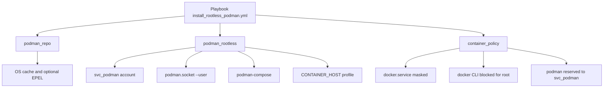

# `tomonix.rootless_podman`

An Ansible collection to deploy Podman and podman-compose in rootless mode on Debian, Ubuntu and RedHat family with a dedicated service account (`svc_podman`) and a container CLI blocking policy.

## Objectives

- Install rootless Podman with a non-privileged service account.
- Enable rootless `podman.socket` for API/compose usage.
- Install `podman-compose` (package first, pip fallback).
- Disable root Docker services and block root Docker CLI usage.
- Restrict `podman` and `podman-compose` usage to the service account only.
- Provide a readable, modular, and idempotent collection.

## Architecture



## Roles

- `tomonix.rootless_podman.podman_repo`
- `tomonix.rootless_podman.podman_rootless`
- `tomonix.rootless_podman.container_policy`

## Main Variables

| Variable | Default value | Description |
|---|---|---|
| `podman_rootless_service_user` | `svc_podman` | Service account for rootless Podman |
| `podman_rootless_install_compose` | `true` | Installs `podman-compose` |
| `podman_rootless_compose_fallback_to_pip` | `true` | Fallback to pip when package is unavailable |
| `podman_rootless_socket_state` | `started` | User podman socket state (`started` or `stopped`) |
| `container_policy_disable_docker_system_service` | `true` | Stops/disables/masks `docker.service` and `docker.socket` |
| `container_policy_enforce_root_docker_cli_block` | `true` | Blocks `docker` command usage for root through profile |
| `container_policy_enforce_podman_service_account_only` | `true` | Blocks `podman` and `podman-compose` for every user except `svc_podman` |

## Prerequisites

- `ansible-core >= 2.14`
- Debian/Ubuntu or RedHat-family target host
- SSH access and privilege escalation (`become`)
- Internet access on target hosts (packages)

## Run

```bash
ANSIBLE_LOCAL_TEMP=/tmp ANSIBLE_REMOTE_TEMP=/tmp \
ansible-playbook collections/ansible_collections/tomonix/rootless_podman/playbooks/install_rootless_podman.yml
```

## Post-Install Verification

On the target host:

```bash
su - svc_podman -c 'podman info'
su - svc_podman -c 'podman-compose --version'
su - svc_podman -c 'systemctl --user status podman.socket'
systemctl status docker.service docker.socket
```

Expected result:

- `podman info` responds for `svc_podman`.
- `podman-compose --version` responds.
- `podman.socket` is enabled for `svc_podman`.
- `docker.service` and `docker.socket` are masked/inactive.
